# Inception

.width-80[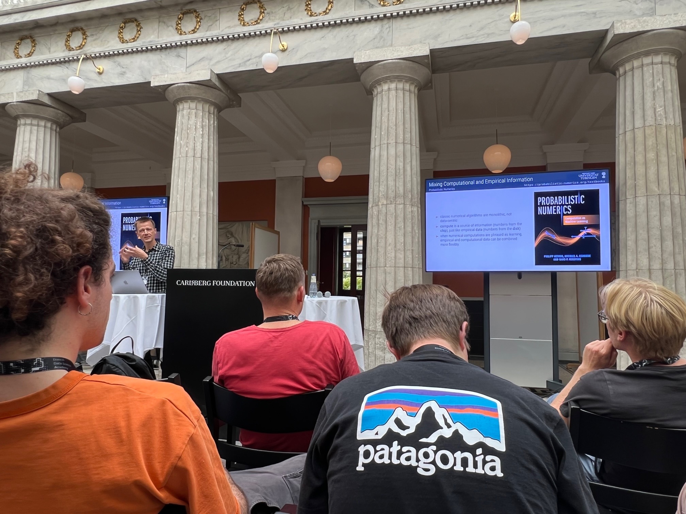]

.footnote[Philipp Hennig, Inference through simulations with Differential Equation Filters, Gen U 2022]

???
- Same spirit
- We have to develop new methods that benefit from the availability of data and computing
- Improve the way we do science

---

class: middle
count: True
# The Symbiosis between Deep Probabilistic and Scientific Models
## Antoine Wehenkel
### Generative Models and Uncertainty Quantification Workshop
#### September 2022 - Copenhagen

???

---

# Our lab in Liège

.avatars[.circle.width-100[].circle.width-100[]]

## Research Topics:
- Methodological development in SBI;
- Applications in particle physics, astrophysics, astronomy, robotics, ...;
- Algorithmic development in deep learning.

<table class="transparent float-left">
<tr>
<th>

</th>
</tr>
<tr>
<th>
Gilles Louppe (Professor)
</th>
</tr><tr>
<th>
</table>

<table class="transparent float-right">
<tr>
  <th>
 
</th>
  <th>
 <a href="https://awehenkel.github.io/"> 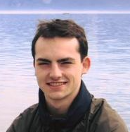</a>
</th>
  <th>
 
</th>
</tr>
  <th> Norman Marlier </th>
  <th> Antoine Wehenkel </th>
  <th> Maxime Quesnel </th>
<tr>
  <th>
 
</th>
  <th>
 
</th>
  <th>
 
</th>
  <th>
 
</th>
</tr>
<tr>
  <th> Malavika Vasist </th>
  <th> Arnaud Delaunoy </th>
  <th> François Rozet </th>
  <th> Omer Rochman </th>
</tr>
</table>

---

# Next adventure: 
.avatars[.circle.width-100[].circle.width-100[]]
## My Research Interests:
 

### *Deep probabilistic models + scientific models = 🖤*
 
 

## Collaborators
<table class="transparent float-left">
<tr>
  <th>
 
</th>
  <th>
 
</th>
  <th>
 
</th>
</tr>
<tr>
  <th> Jörn-Henrik Jacobsen </th>
  <th> Jens Behrmann </th>
  <th> Guillermo Sapiro </th>
</tr>
</table>

---
# The promise

.center.width-80[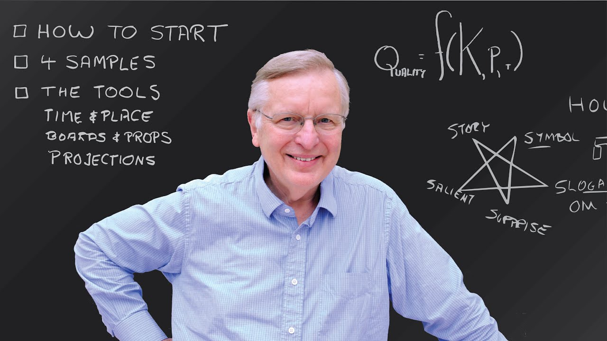]

???

- Patrick Winston (February 5, 1943 – July 19, 2019)
- Start by a promise
- Explain why I believe there is a symbiosis between deep probabilistic modelling,
the act of building models parameterized by deep neural nets and Scientific modelling, building models from existing knowledge and experiments.

---
# Modern Science

.center.circle.width-40[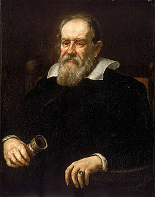]

???
- Do you recognize this Italian Guy ?
- Galileo Galilei

né à Pise le 15 février 1564 et mort à Arcetri près de Florence le 8 janvier 1642, est un mathématicien, géomètre, physicien et astronome italien du xviie siècle.
Heliocentrisme

- I wanted to quote him but then I remembered that I did not speak italian.

---
# Modern Science

.center.circle.width-40[]

Galileo Galilei (1564 - 1642)

???
- Do you recognize this Italian Guy ?
- Galileo Galilei

né à Pise le 15 février 1564 et mort à Arcetri près de Florence le 8 janvier 1642, est un mathématicien, géomètre, physicien et astronome italien du xviie siècle.
Heliocentrisme

- Say He argued for checking knowledge in front of experiments:
- observing, experimenting, and analyzing

---
class: top
count: True
# Modern Science

.center.circle.width-40[]

.quote[If it disagrees with experiment, it’s wrong. In that simple statement is the key to science.]

.pull-right[Richard Feynman.]

???
- Nobel prize in physics
- great teacher.

---
# Scientific modelling

--
## The Box's Loop
.avatars[.circle.width-100[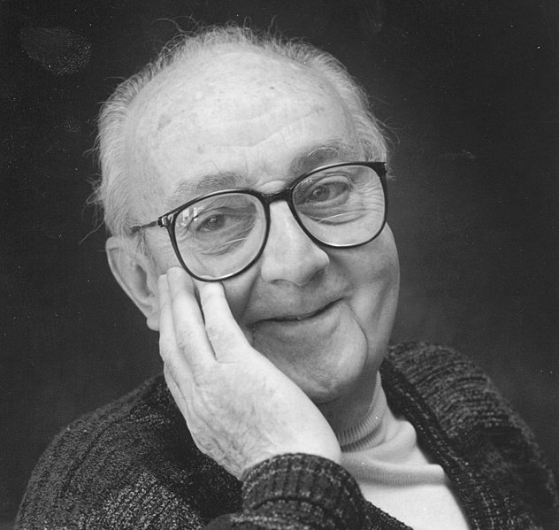]]
.center.width-100[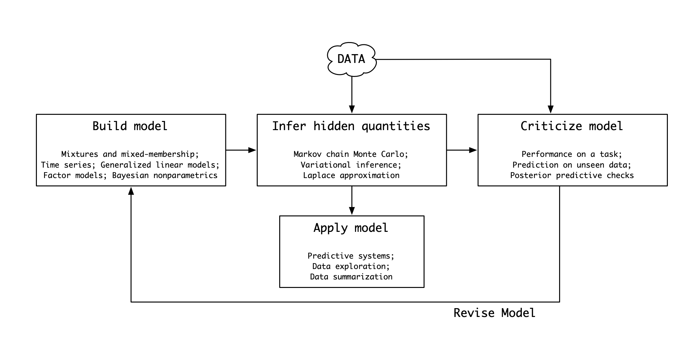]

.footnote[Credits: Blei, David M. “Build, compute, critique, repeat: Data analysis with latent variable models.”]

???
- Explain each step of the nature of scientific method
- This is the way we build model of the world and that we convince ourselves that we understand a bit how nature works.
- Example Dalton said atom were the smallest indivisible particle and neutral.
  - Then JJ Thomson made an experiments that basically proved there was a negatively charged particules that were lightest than the atom, and so atoms couldn't be the smallest indivisible particle.
---
# Machine learning modelling

--
## The Box's Loop
.avatars[.circle.width-100[]]
.center.width-100[]

.footnote[Credits: Blei, David M. “Build, compute, critique, repeat: Data analysis with latent variable models.”]
???
This is actually the same process.

The difference between the two lies in the way we build models at first hand and what kind of data we use.
Domain knowledge vs lot of data + inductive vias = weak domain knowledge

---
# Scientific vs ML

.width-100[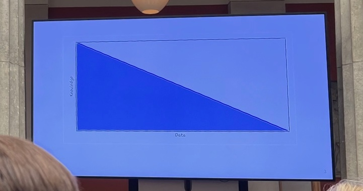]

.footnote[Carl Henrik Ek, Generative Model for Sequential Alignment]

???
- Main difference between machine learning and scientific models

---
# Scientific vs ML
.grid[

.kol-6-12[
## In science
- Scarce data
]
.kol-6-12[
## In machine learning
- "Big" Data
]

]
---

# Scientific vs ML
.grid[

.kol-6-12[
## In science
- Scarce data
- Domain knowledge
]
.kol-6-12[
## In machine learning
- "Big" Data
- "inductive bias"
]

]

---

# Scientific vs ML
.grid[

.kol-6-12[
## In science
- Scarce data
- Domain knowledge
- Domain specific
]
.kol-6-12[
## In machine learning
- "Big" Data
- "inductive bias"
- Generic
]

]

---

# Scientific vs ML
.grid[

.kol-6-12[
## In science
- Scarce data
- Domain knowledge
- Domain specific
- Few parameters
]
.kol-6-12[
## In machine learning
- "Big" Data
- "inductive bias"
- Generic
- Many parameters
]

]

---
# Deep probabilistic models for science

.center.width-100[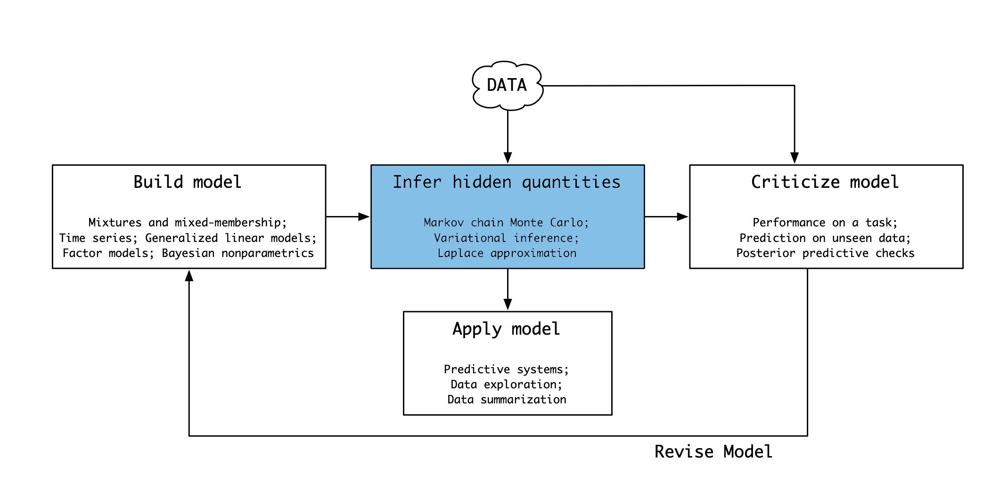]

???
- What do I mean by deep probabilistic models.
- We see how the probabilistic modelling frameework unifies ML and scientific discovery.
- That said now I will show you an example where Deep learning is impacting the Box's loop in the scientific model discovery

---
# Deep probabilistic models for science

.center.width-100[]
---
class: middle
count: false
# Simulation-based Inference

.center.width-100[]
.footnote[Credits: Johann Brehmer.]

???
- Explain the kind of simulator
- Low dimensional parameters of interests
- Physical interpretation of these
- Can generate high dimensional data
- Are stochastic, random choice are made over the program execution.

---
class: middle
count: false
# Simulation-based Inference

.center.width-100[]
.footnote[Credits: Johann Brehmer.]

???

---
# Intractibility

.grid[
.kol-6-12[.center.width-100[]]
.kol-6-12[.center.width-100[]]
]

$$p(x|\theta) = \underbrace{\\iint ... \\int}\_{\text{intractable}} p(z\_1|\theta) p(z\_2|z\_1, \theta) ... p(x|z\_d, \theta) dz\_1 dz\_2 ... dz\_d$$
.footnote[Credits: Gilles Louppe.]
---
# Neural Likelihood

.grid[
.kol-3-4[
Learn $p(x \mid \theta)$ -- E.g. with a normalizing flow.
## Wilks' theorem:
$H\_0: \theta \in \Theta\_0 \subset \Theta$ vs $H\_1: \theta \notin \Theta\_0$,

]
.kol-1-4[ .width-100[]]
]

Under $H\_0$: $-2\\log \\frac\{\\sup\_\{\\theta\_1 \\in \\Theta\}p(x \\mid \\theta\_1)\}\{\\sup\_\{\\theta\_0 \\in \\Theta\_0\}p(x \\mid \\theta\_0)\} \\rightarrow \\chi^2$ as $|x| \\rightarrow \\infty$.
???

- Say that amortization is great because we can then analyse as many samples as we want.
- The numerator is the likelihood at the MLE.

--

# Can we do better?

???
- Yes learning p(x|theta) is hard as ML task.
- An alternative is to learn a classifier, as we know the optimal classifier learns the likelihood ratio.

---

class: top

# Bayesian inference
.avatars[.circle.width-100[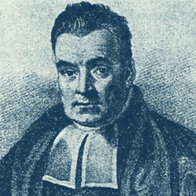]]

We want to evaluate $p(\theta|x) = \frac{p(\theta)p(x|\theta)}{p(x)}$, where:
- $p(\theta)$ is your *chosen* prior.
- $p(x|\theta)$ the *unknown/intractable* likelihood function:
- $p(x)$ the marginal distribution of the data.

--

# Why is it better?

???
- It only models a distribution over theta which is low dimensional

---
# Neural Posterior Estimation

Learn $p(\theta \mid x)$ with a normalizing flow.

--

# But we only have samples from $p(x \mid \theta)$ !?

---
.center.width-90[]
---
.center.width-90[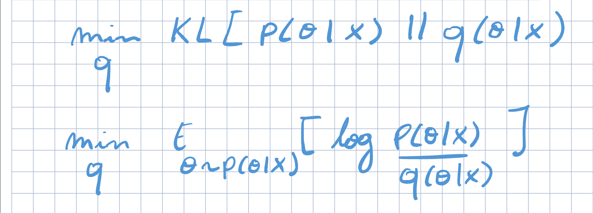]
---
.center.width-90[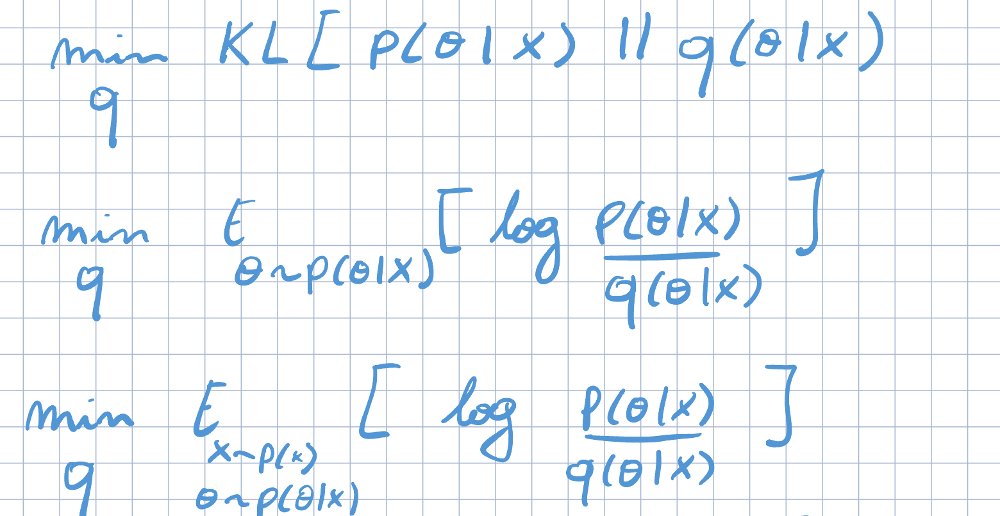]
---
.center.width-90[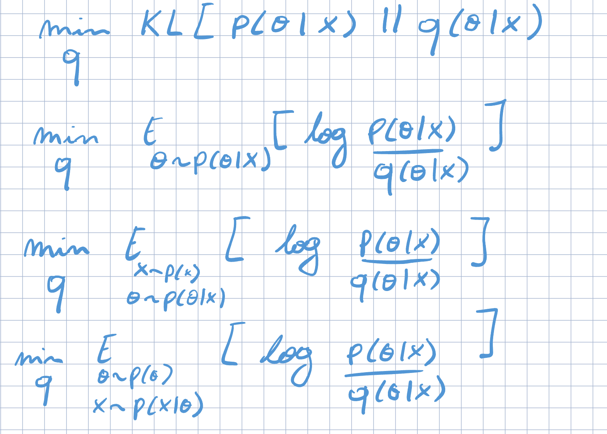]
---
.center.width-90[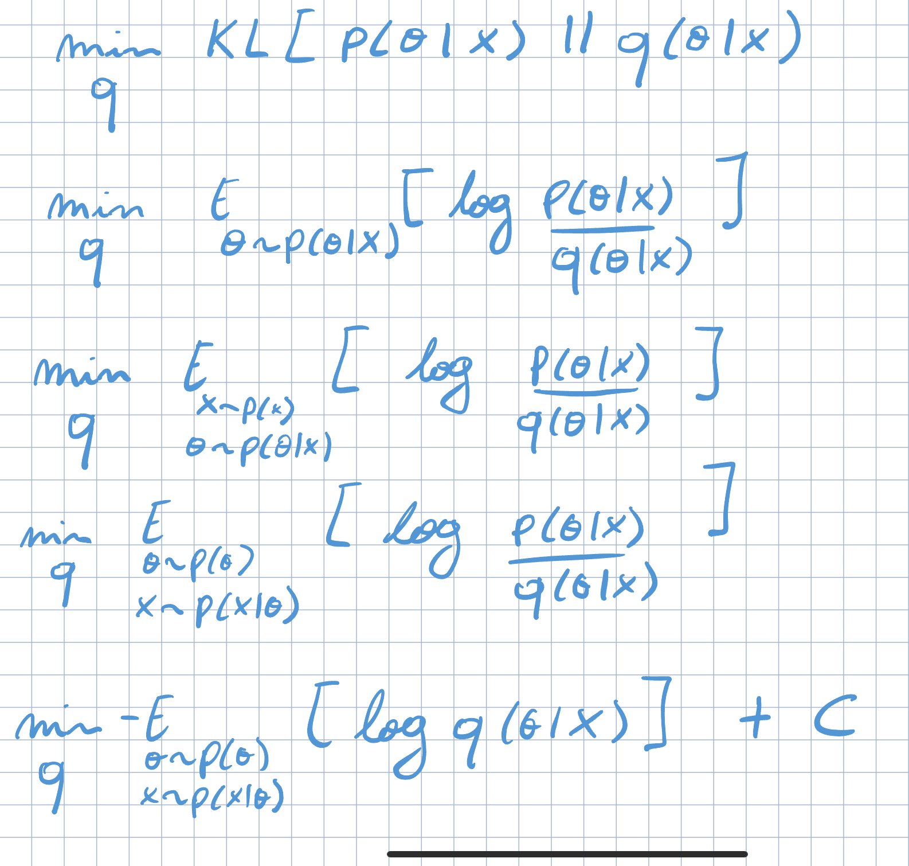]

---
# Analysis speed up  

.center.width-70[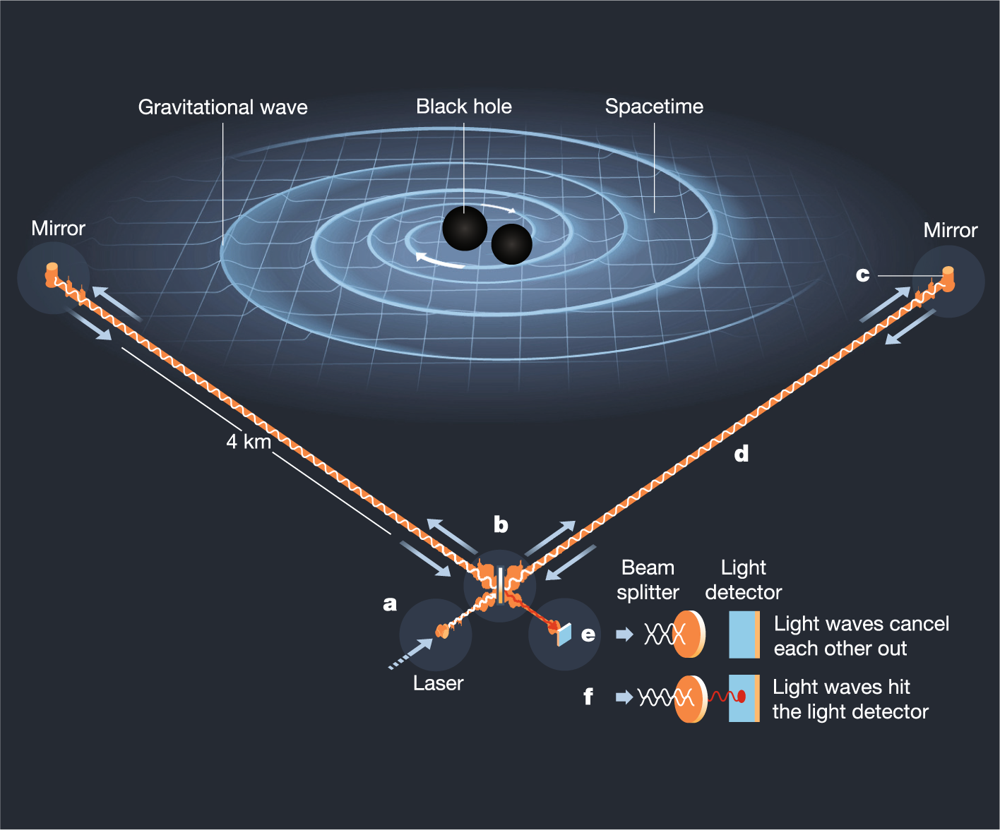]

.footnote[
Lightning-fast gravitational wave parameter inference through neural amortization,  Arnaud Delaunoy, et al.  
Real-Time Gravitational Wave Science with Neural Posterior Estimation, Maximilian Dax, et al.
]

???
- This methods can really help scientists
- Provides a sound and fast  way to analyse experimental results.
- Explain GW
- Explain why it is interesting to be fast.
- multi messenger astronomy

---
# Deep probabilistic models for science

.center.width-100[]

Science does not end at the inference results.

???
Science does not end at the inference results.
Instead, they should inform the next revision of the model.

---
# Science for deep probabilistic modelling

.center.width-100[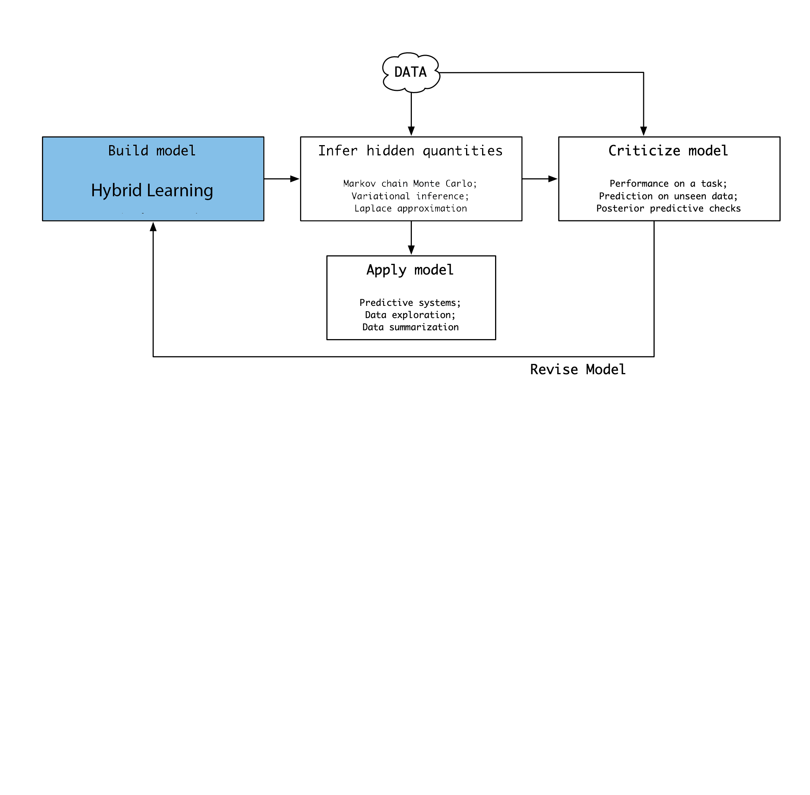]

???
- Now showing how scientific models can help ML.

---

# Science vs Machine learning

.center.width-60[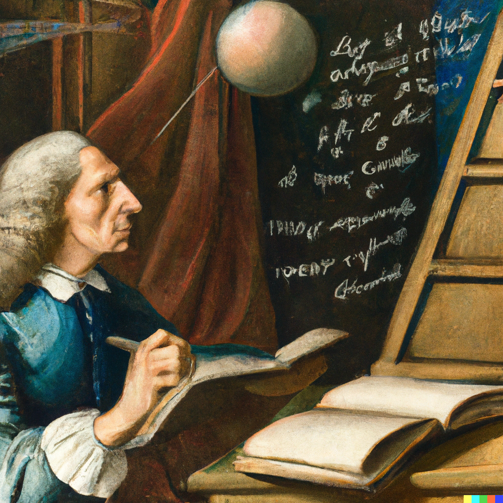]

???
- Scientific models are often nice
- Do not require a lot of data to fit parameters
- A certain level of explainability
- But they requires to  be  in the exact right context
- Additional sources of perturbations are not described by human-made models.

---

# Science vs Machine learning

.center.width-60[]

???
- Machine on the opposite is very flexible
- Requires data
- Work well in settings similar to the data

---

# Hybrid learning

.center.width-60[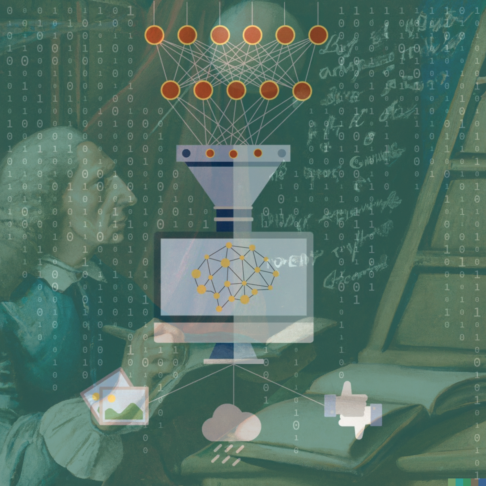]
???
Hybrid learning tries to combine the type of models in one paradigm.

---

# Hybrid learning
.center.width-100[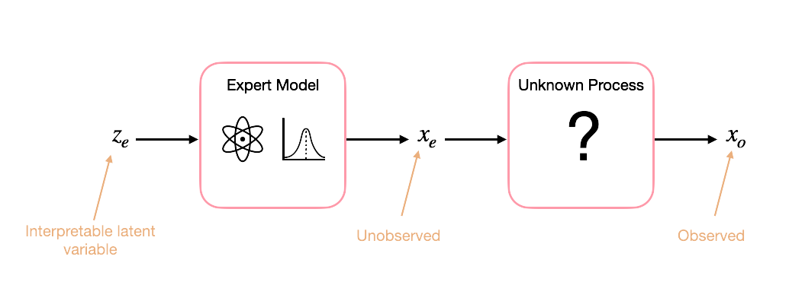]
---

# Hybrid learning
.center.width-100[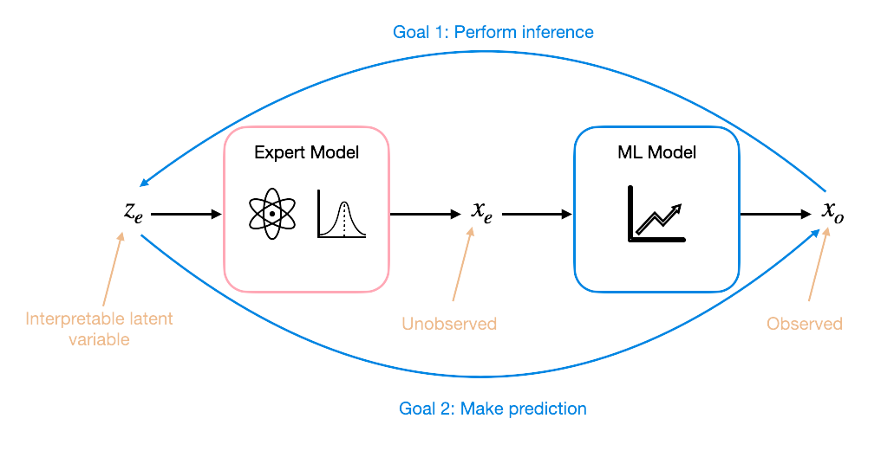]
---

# Hybrid learning
.center.width-60[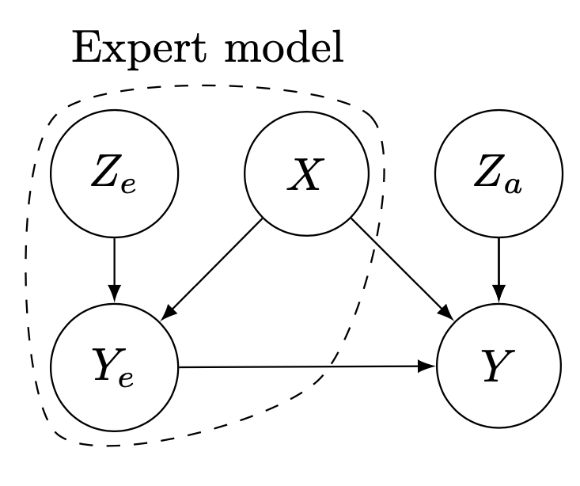]

---
# Robust hybrid learning
.avatars_small[.width-40[] .width-40[] .width-40[] .width-40[]]
.center.width-80[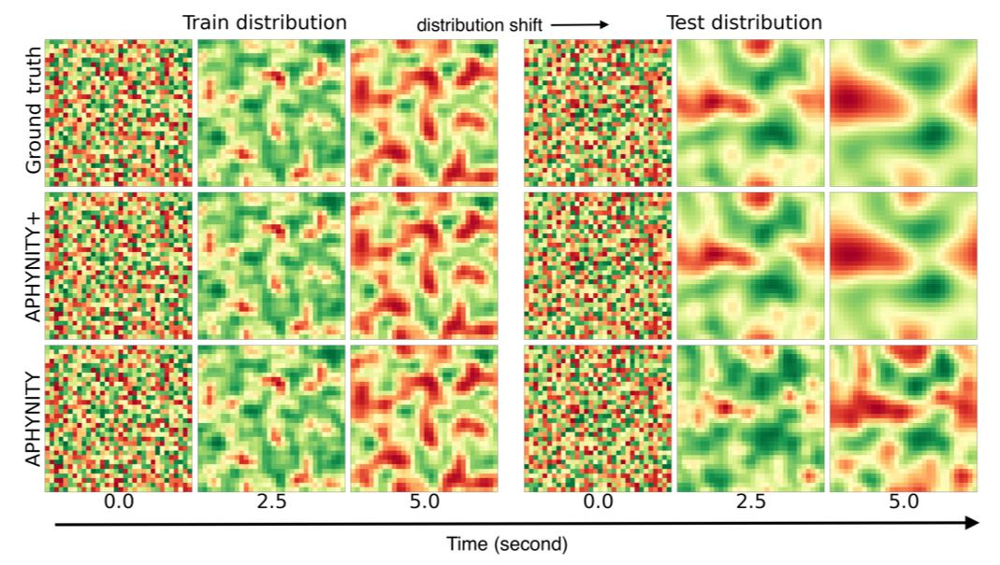]
.center[
$\\frac{dy\_t}{dt} = F\_e(y\_t; z\_e) + F\_a(y\_t; z\_a)$  
 $F\_e := \\begin{bmatrix}a \\Delta u\_t b \\Delta v\_t \\end{bmatrix}^T$ and
 $F\_a := \\begin{bmatrix}R\_u(u\_t, v\_t;k) \\\\ R\_v(u\_t, v\_t)\\end{bmatrix}^T$
]
.footnote[Robust Hybrid Learning With Expert Augmentation, Antoine Wehenkel et al.]

---
# Probabilistic modelling unifies Science and Machine learning

.center.width-100[]
---
# Perspectives
- ML models that use science
  - How to ease the interplay between models?
--

- Is the common distinction between scientific and ML models meaningful?
  - In some sense it is, but as ML is impacting science and vice versa, will it really stay like this?
  - Scientific models are getting more and more complex
--

- Scientific models extracted from ML
  - Symbolic discovery
