class: title-slide
count: True

# Normalizing Flows
# and
# Bayesian Networks

.absolute.top.left.width-40[]
.absolute.top.right.width-15[]

.center[*HES Geneva, February 2022*]
.center[Antoine Wehenkel]

???
First let me thank you for having me. I am very glad to talk about normalizing flows and Bayesian networks here for the next 20 minutes!

---
# Our lab in Liège

## Research Topics:
- Methodological development in SBI;
- Applications in particle physics, astrophysics, astronomy, robotics, ...;
- Algorithmic development in deep learning.

<table class="transparent float-left">
<tr>
<th>

</th>
</tr>
<tr>
<th>
Gilles Louppe (Professor)
</th>
</tr><tr>
<th>
</table>

<table class="transparent float-right">
<tr>
  <th>
 
</th>
  <th>
 
</th>
  <th>
 
</th>
  <th>
 
</th>
</tr>
  <th> Joeri Hermans </th>
  <th> Antoine Wehenkel </th>
  <th> Norman Marlier </th>
  <th> Maxime Quesnel </th>
<tr>
  <th>
 
</th>
  <th>
 
</th>
  <th>
 
</th>
  <th>
 
</th>
</tr>
<tr>
  <th> Malavika Vasist </th>
  <th> Arnaud Delaunoy </th>
  <th> François Rozet </th>
  <th> Omer Rochman </th>
</tr>
</table>

---
# *Today's menu*
 
.center[
## *Entree*
## Introduction to normalizing flows
## *Plat*
##  Normalizing flows as Bayesian networks
## *Dessert*
##  Graphical normalizing flows
]
---

class: section

# Introduction to normalizing flows

---

# Normalizing flows

.important[A normalizing flow is a *bijective function* used to model a *probability distribution* via a *change of variables*.]

.center[.width-100[]]

.footnote[https://lilianweng.github.io/lil-log/2018/10/13/flow-based-deep-generative-models.html]

---

# Density Estimation 👇

.center.grid[
.kol-5-12.width-70[]
.kol-2-12.width-100[   ]
.kol-5-12.width-70[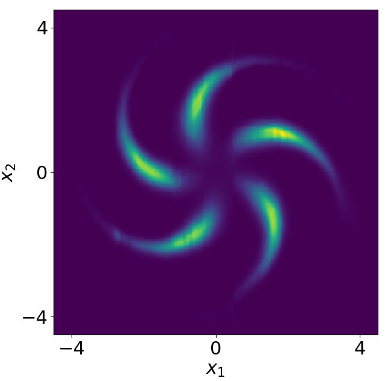]
]
> Density estimation aims at estimating the pdf of underlying data from an iid dataset.

## Applications:
- Model uncertainty: e.g., reinforcement learning, approximate inference in SBI, ...;
- Out Of Distribution detection;
- Sampling.

---

class: left
# Change of Variables Theorem (1)
.top[> Given a random variable $\mathcal{Z}$ and a differentiable bijective function $f$, what is the density of $\mathcal{X} = f(\mathcal{Z})$?]

--
count: false

Assume $p(z)$ is a uniformely distributed unit cube in $\mathbb{R}^3$, and $\mathbf{x} = f(\mathbf{z}) = 2\mathbf{z}$.

.center.width-60[]

--
count: false

The total probability mass must be conserved, therefore $p(\mathbf{x}) = p\_\mathbf{z}(\mathbf{z}) \frac{V\_\mathbf{z}}{V\_\mathbf{x}} = p\_\mathbf{z}(\mathbf{z}) \frac{1}{8},$
 where $ \frac{1}{8} = \left| \det \begin{pmatrix} 2 & 0 & 0 \\\\ 0 & 2 & 0 \\\\ 0 & 0 & 2 \end{pmatrix} \right|^{-1}$ is the determinant of the linear transformation $f$.

.footnote[https://joerihermans.com/talks/ffjord/]

---

class: left

# Change of Variables Theorem (2)
## What if the transformation is non linear?

.grid[
.kol-8-12[
- The Jacobian $J_f(\mathbf{z})$ of $f(\mathbf{z}) = \mathbf{x}$ represents the infinitesimal linear transformation in the neighbourhood of $\mathbf{z}$.
]
.kol-4-12.center.width-100[]
]

.footnote[https://www.lesswrong.com/posts/KKwv9kcQz29vqPLAD/a-primer-on-matrix-calculus-part-2-jacobians-and-other-fun]

--
count: false

- If the function is a differentiable (and so continuous) bijective map then the mass must be conserved locally.

Therefore, we can compute the local change of density as
$$ p(\mathbf{x}) = p\_\mathbf{z}(\mathbf{z}) \left| \det J_f(\mathbf{z})\right|^{-1}.$$

---
class: center

.top[# Change of Variables Theorem (3)]

.important[The right bijective map (with any base distribution) allows to represent any continuous random variable.]

--
count: false

.center[$ p(\mathbf{x}; \mathbf{\theta}) = p\_\mathbf{z}(\mathbf{g}(\mathbf{x}; \mathbf{\theta})) \left| \det J_g(\mathbf{x}; \mathbf{\theta})\right|, \quad \mathbf{g}(.;  \mathbf{\theta})$ a neural network.]
.left[
- The bijective function takes in samples and maps them to noise.
- This process is refered as normalization if the noise distribution is normal.]
.grid[.kol-1-3.width-80[]
.kol-1-3.width-100.middle.center[
.grid[
.kol-3-12[]
.kol-1-2.width-50[]]
.grid[.kol-3-3.center[Density Estimation]]
]
.kol-1-3.width-80[]
]

---
class: center
count: false

.top[# Change of Variables Theorem (3)]

.important[The right bijective map (with any base distribution) allows to represent any continuous random variable.]

.grid[.kol-1-3.width-80[]
.kol-1-3.width-100.middle.center[
.grid[
.kol-3-12[]
.kol-1-2.width-50.horizontal-flip[]]
.grid[.kol-3-3.center[Sampling]]
]
.kol-1-3.width-80[]
]

.center[Once learned, the function can be inverted in order to generate samples.]

---

# Bijectivity with Neural Nets? 🤔
.grid[
.kol-1-1[
- $\begin{bmatrix}z\_1 & ... & z\_d\end{bmatrix} = \mathbf{g}(\begin{bmatrix}x\_1 & ... & x\_d\end{bmatrix})$, $\mathbf{g}$ can be a NN.
- $g$ is autoregressive if it can be decomposed as: $z\_i = g\_i(\begin{bmatrix}x\_1 & ... & x\_i\end{bmatrix})$
- If the $g\_i$ are invertible with respect to $x\_i \forall  i$, $\mathbf{g}$ is bijective.
]
]

--
count: false

## The determinant of the Jacobian can be efficiently computed.
 The Jacobian of an autoregressive tranformation has the following form:
$$J\_F(\mathbf{x})  =
\begin{bmatrix}
\frac{\partial g\_1}{\partial x\_1} &  \frac{\partial g\_1}{\partial x\_2} & \frac{\partial g\_1}{\partial x\_3}\\\\
\frac{\partial g\_2}{\partial x\_1} &  \frac{\partial g\_2}{\partial x\_2} & \frac{\partial g\_2}{\partial x\_3}\\\\
\frac{\partial g\_3}{\partial x\_1} &  \frac{\partial g\_3}{\partial x\_2} & \frac{\partial g\_3}{\partial x\_3}
\end{bmatrix}
=
\begin{bmatrix}
\frac{\partial g\_1}{\partial x\_1} &  0 & 0\\\\
\frac{\partial g\_2}{\partial x\_1} &  \frac{\partial g\_2}{\partial x\_2} & 0\\\\
\frac{\partial g\_3}{\partial x\_1} &  \frac{\partial g\_3}{\partial x\_2} & \frac{\partial g\_3}{\partial x\_3}
\end{bmatrix}.$$

--
count: false

## Chain Rule

 An autoregressive density estimator learns the chain rule's factors:
$p(\mathbf{x}) = p(x\_1)\Pi^{d}\_{i=2}p(x\_i|x\_1,...,x\_{i-1}).$

---

#Example: Masked Autoregressive Networks
> Idea: Autoregessive Networks combined with linear transformations.

- $z\_1 = \sigma\_1 \times x\_1 + \mu\_1$
- $z\_i = \sigma\_i(x\_1, ..., x\_{i-1})\times x\_i + \mu\_i(x\_1, ..., x\_{i-1})$

--
count: false

## Invertible?
- $x\_1 = g^{-1}\_1(\begin{bmatrix}z\_1 & ... & z\_{d}\end{bmatrix}) = g^{-1}\_1(z\_1) = \frac{(z\_1 - \mu\_1)}{\sigma\_1}$
- $x\_i = \frac{z\_i - \mu\_i(\begin{bmatrix}x\_1 & ... & x\_{i-1}\end{bmatrix})}{\sigma\_i(\begin{bmatrix}x\_1 & ... & x\_{i-1}\end{bmatrix})}$
---
#Example: Masked Autoregressive Networks
> Idea: Autoregessive Networks combined with linear transformations.

But linear transformations are not very expressive:

.center[]

---

count: True

# NFs pros 💪
.grid[
.col-4-12[
- Access to the model's likelihood
]
]
.absolute.bottom.width-80.center[]

???
We may agree on the fact that normalizing flows are becoming more and more popular recently. This can be partly explained by the fact that, in contrast to other generative models, we have access to the model's likelihood. This provides a good loss function and may also be used to compare different normalizing flow models.
---
count: false

# NFs pros 💪
.grid[
.col-4-12[
- Access to the model's likelihood
- Universal density estimators
]
]
.width-70.absolute.bottom.center[]

???

A great advantage of NFs as density estimation methods is that some architectures have been shown to be universal density approximators of continuous random variables. As an example here, you can see in the first row 5 2D datasets whose density is multimodal or almost discontinuous and with complex shapes. And you see in the second the density learned by a normalizing flow, in the last these are new samples generated with the flow. They match well with the training data.

---
count: false

# NFs pros 💪
.grid[
.col-4-12[
- Access to the model's likelihood
- Universal density estimators
- Good results for high dimensional data
]
]
.center[<video frameborder="0" width="600" height="280" controls loop autoplay>
  <source src="figures/glow_video.mp4" type="video/mp4"  controls loop autoplay>
</video>]

.footnote[https://openai.com/blog/glow/]

???

And probably the best explanation why these models are gaining in popularity is because they work well in practice, even for data with a high dimensionality such as images. For example, here we see the results of GLOW, a NF architecture designed for images, trained of the celebA dataset.

---

# NFs cons 😈

.grid[
.col-4-12[
- Arbitrary architectural choices
]
]
.absolute.bottom.width-60[]

???

Nevertheless flows are not perfect yet. In my opinion one big obstacle when using NFs is to decide which architecture to use, there is a lot of different possibilities, and you can even combine multiple different architectures. But in general it is not always easy to know which one to select.

---
count: false

# NFs cons 😈

.grid[
.col-4-12[
- Arbitrary architectural choices
- Hard to interpret
]
]
.absolute.bottom.width-100[]

???

Another drawback of NFs is that they are kind of black box, even if I don't like this expression when talking about neural networks. We must admit that understanding the hypothesis made on the data distribution modeled by a flow is often not easy.

---
count: false

# NFs cons 😈

.grid[
.col-4-12[
- Arbitrary architectural choices
- Hard to interpret
- Poor inductive bias
]
]
.absolute.bottom.grid[
.kol-4-12[
.width-100[]
].kol-8-12[
.absolute.bottom.width-80[]
]
]

???

These 2 drawbacks combined end up in a poor inductive bias. Indeed, the fact that we cannot easily understand why maybe the model is not working as expected makes it harder to iterate on the architecture choice and to find the architectural modification that improve the model.

---

# Inductive bias in NFs
How is it tackled now?
.grid[
.kol-6-12[
- For images:
  - Coupling layers
]
.kol-6-12[
.width-80[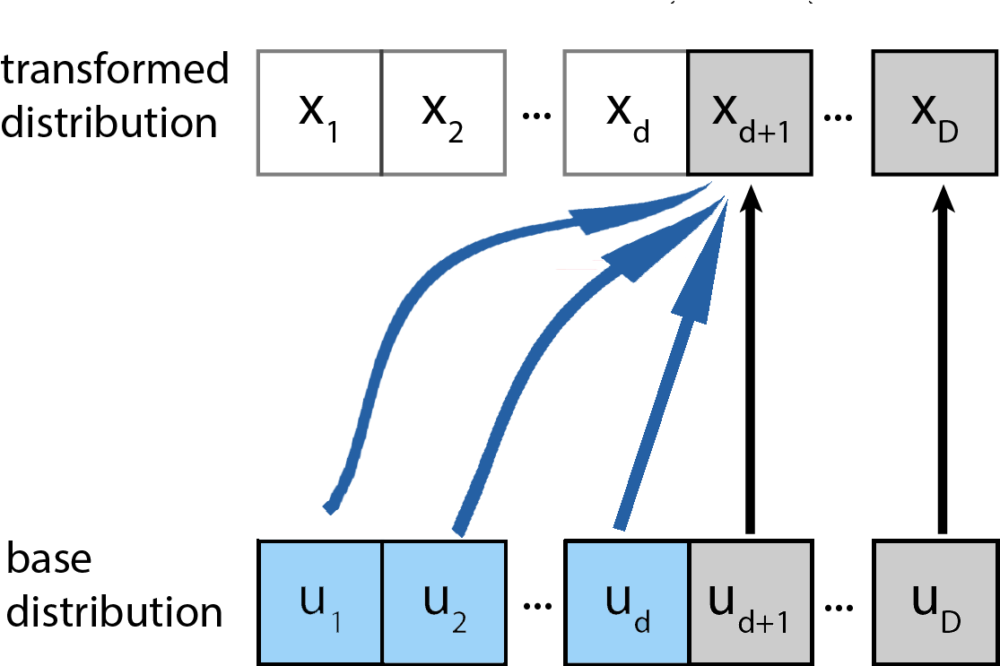]
]]

???

Of course the inductive bias problem I mention is not completely unsolved. As an example, I showed you good results for images, these ones are based on coupling layers. I will come back to these layers in the next slides but for now just understand that coupling layers split the output vector into two parts and makes the assumption that the components of the first part are independent from each other and the components of the second parts are independent from each other conditionally to the components from the first parts.

---

# Inductive bias in NFs
How is it tackled now?
.grid[
.kol-6-12[
- For images:
  - Coupling layers
  - Multi-scale architectures
]
.kol-6-12[
.width-80[]

.width-100[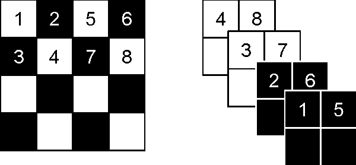]
]]

.footnote[Dinh L, Sohl-Dickstein J, Bengio S. Density estimation using real nvp.]

???

Then, if we combine these coupling layers with a multi-scale architecture, that is a way of stacking the flow step that scales with high dimensional data. And if we are smart on how we split the vector into two parts, for example by using this kind of patterns. Then we obtain a good inductive bias for images.

---
count: false

# Inductive bias in NFs
How is it tackled now?
.grid[
.kol-6-12[
- For images:
  - Coupling layers
  - Multi-scale architectures
- For time series:
  - Autoregressive architectures
]
.kol-6-12[
.width-100[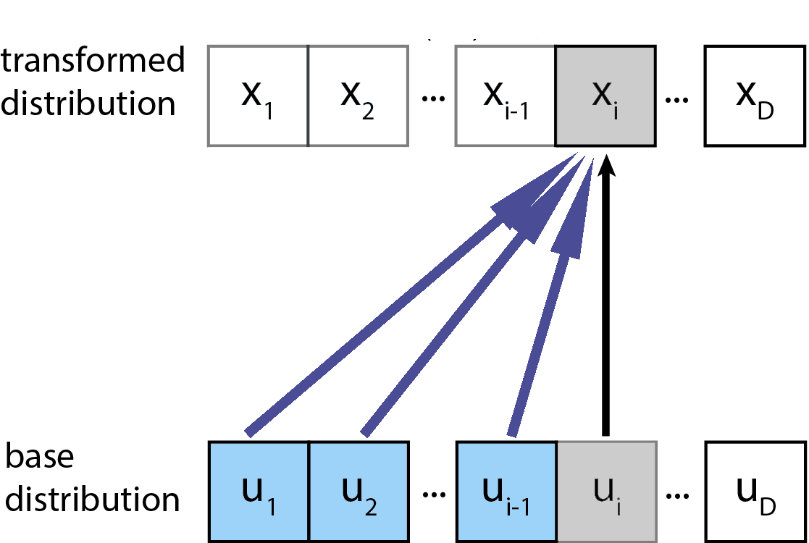]
]]

.footnote[https://blog.evjang.com/2018/01/nf2.html]

???

Similarly, if we are working with time series, we can use autoregressive architectures, there we do not make any independence assumptions but we kinda say that the non-randomness of the future can be predicted from the past. I will come back to autoregressive layers later.

---
count: false

# Inductive bias in NFs
How is it tackled now?
.grid[
.kol-6-12[
- For images:
  - Coupling layers
  - Multi-scale architectures
- For time series:
  - Autoregressive architectures
- What about tabular data or mixed data?
]
.kol-6-12[
.width-100[]
]]

.important.center[It is not easy to design the architecture and to understand the modeling assumptions!]

???

When the data are tabular then there is no architecture that will particularly put a good inductive bias. There are architectures that are able to take into account some symmetries and so on but they are not really helping with tabular data.

---

class: section

# Normalizing flows as Bayesian networks

---
count: false

# Bayesian Networks

- Probabilistic graphical models formally introduced by Judea Pearl in the 80's
- A Bayesian network is a directed acyclic graph that factorizes the model distribution as $$p(\mathbf{x}) = \prod_{i=1}^D p(x\_i|\mathcal{P}\_i).$$
- e.g when $d=4$:
.grid[.kol-8-12[$p(\mathbf{x}) = p(x\_1) p(x\_2|x\_1) p(x\_3|x\_2)p(x\_4|x\_1, x\_2, x\_3)$]
.kol-4-12[.width-100[]]]

???
On the opposite one class of models that have been popular to model the joint probability distribution of tabular data are Bayesian networks. These are Probabilistic graphical models formally introduced by Pearl in the 80's. These models vizually depicts through a directed acyclic graph the factorization of the distribution modeled. And we can read the graph to check whether or not some independencies are hypothesized by the model. For example with a vector of dimension 4, we could assume the following bayesian net, that would be equivalent to assume that the joint distribution of p(x) is given by the following factorization. And then we can use the BN and an algorithm that is called d-separatation to see that this factorization implies that x1 is independent from x3 given x2 and x4.

---

# BNs: pros 💪 and cons 😈

- Good for modeling independencies and check their global impact on the modeled density 💪

???

The models have good and bad sides of course. One pro, is that these models are good for modeling independencies and check their global impact on the modeled density.

--

- Applications across science and technology 💪

???

They are often used to reason about problems and even in real world applications. Bayesian networks are good for theoretical reasoning about some probalistic models but can also directly be used for real world applications.

--

- Often used with discrete or discretized data 😈

???
Regarding the drawbacks, one is that in real world applications, that is when one wants to access the conditional factors these have been mostly demonstrated with discrete or discretized data.

--

- Do not handle large datasets naturally. 😈

???

It is also somewhat outdated with respect to the most recent methods, for example now if you want to model a data distribution you will probably use flows instead of Bayesian nets.

---

# Autoregressive NFs are BNs

.grid[
.kol-6-12[
.width-100[]
].kol-2-12[].kol-4-12[
.width-100[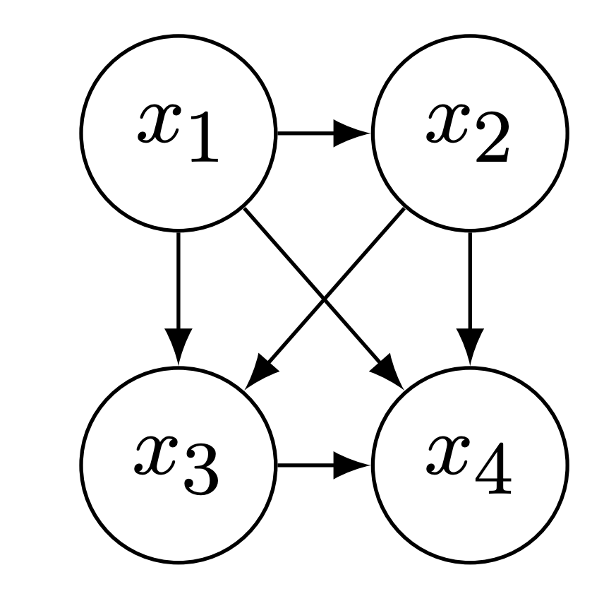]
]]

The flows can be expressed as: $x_i = f(u_i; \mathbf{c}^i(\mathbf{u}))$,

where the autoregressive conditioner is $\mathbf{c}^i(\mathbf{u}) = \mathbf{h}^i\left(\begin{bmatrix} u\_1 & ... & u\_{i-1} \end{bmatrix}^T\right).$

An autoregressive density estimator learns the chain rule's factors:
$p(\mathbf{x}) = p(x\_1)\Pi^{D}\_{i=2}p(x\_i|x\_1,...,x\_{i-1}).$

???

What is interesting is that the factorization implied by some flow layers can be expressed by a Bayesian network. To be precise, when we use an autoregressive layer to transform a base latent vector u into a vector x that follows a target distribution, we model each output xi as a function f of the corresponding component ui of the base vector, the function f is invertible with respect to xi and ui and is conditioned on the previous components of the base vector. In other words, we condition the invertible transformation f, that I call the normalizer. We condition this normalizer with the output of a function ci of the input vector u. If we talk about autoregressive layers, this function ci only depends on the first i-1 components of the input vector. In 4D, this is equivalent to assuming the following Bayesian Net and modeling each factor of the factored distribution.

---

# Coupling NFs are  BNs
.grid[
.kol-6-12[
.width-70[]
].kol-2-12[].kol-4-12[
.width-60[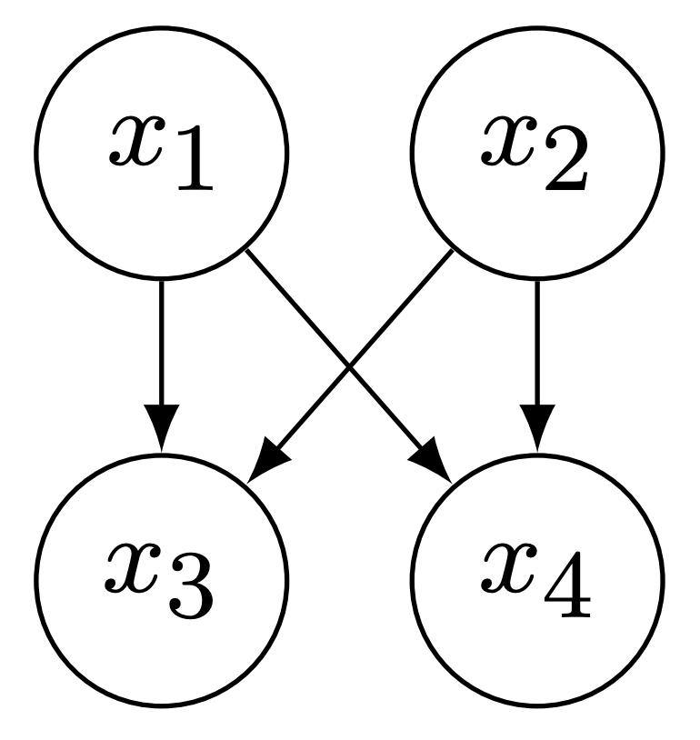]
]]
The coupling conditioner can be defined as $\mathbf{c}^i(\mathbf{u}) =$
- $\underline{\mathbf{h}}^i \quad \text{if} \quad i \leq d$ (a constant);
- $\mathbf{h}^i\left(\begin{bmatrix} u\_1 & ... & u\_d \end{bmatrix}^T\right)$ if $i > d$.

Coupling learns the factors of the following factorization:
$p(\mathbf{x}) = \Pi^{d}\_{i=1}p(x\_i)\Pi^{D}\_{j=k+1}p(x\_j|x\_1,...,x\_{d}).$

.footnote[https://blog.evjang.com/2018/01/nf2.html]

???
I won't go into the details but we can show that is valid as well for coupling layers. So this all means that two of the most commonly used layers in NFs architectures can be seen as BN with a specific topology.

---
class: section

# Graphical normalizing flows

---

# Is the opposite true? 💡

???
Then comes the question.: Can any BN lead to a NF layer?
--

.center.width-60[]

???

The answer is yes. Indeed, you can imagine that you may use a flow to model each of the factors defined by the Bayesian net.

---
count: false

# The graphical conditioner

.grid[.kol-6-12[Let $A \in $ {$0, 1$}$^D$ be the adjacency matrix of a given Bayesian network for a random vector $\mathbf{x} \in \mathbb{R}^d$.
We define the graphical conditioner as: $\mathbf{c}^i(\mathbf{u}) = \mathbf{h}^i(\mathbf{u} \odot A_{i,:}).$]
.kol-6-12[.center.width-50[]
]
]
.center.width-50[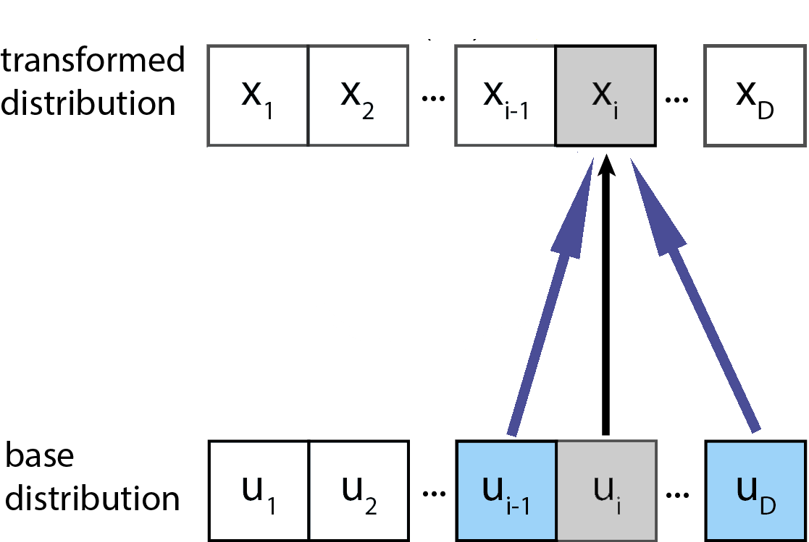]

???

In particular, given an hypothesized bayesian network, that could model the autoregressive or coupling layers, but as well any other assumptions that make sense for the data you're playing with. We defined the graphical conditioner, as a free-form function h of the one by one product of the base vector u with the row i of the adjacency matrix, that is a matrix where an element i j is equal to one if and only if the node j is a parent of the node i in bayesian net. This is just equivalent to masking off the element of the vector u that are not a direct ancestor of the node i. And so now the conditioning components of each factor are defined by any BN instead of being either coupling or autoregressive.

---

# Useful in practice?
.grid[.kol-6-12[
- It can be critical or convenient to ensure some independencies.
  - E.g. assuming independencies between gender and salary.]
  .kol-6-12[]
]

???
I am not gonna say that it is useless of course. But it may really be useful in practice as Bayesian networks may be. Indeed one may be interested to ensure that our model respects some assumptions. For example if we are modeling a dataset about people and their salary we could like ensuring gender and salary are independent from each other.

---
count:false

# Useful in practice?
.grid[.kol-6-12[
- It can be critical or convenient to ensure some independencies.
  - E.g. assuming independencies between gender and salary.
- Knowing the topology helps learning good densities.
]
.kol-6-12[.width-100[]]
]

???

And it may be useful to put the right inductive bias. As an example here look at the plot where the y-axis is the likelihood of the model and just do not care about the x-axis, the red line is the likelihood of a graphical layer with a correct BN for the data we are training on and the green line is corresponds to an autoregressive layer. We see that the graphical leads to the best performance. This is because making the right independence assumption and forcing the model to ensure them help getting a better model with a smaller amount of data.

---

# Why not learning the topology?
- Any BN corresponds to a DAG, but any DAG can be seen as the topology of a BN as well.

???

Often we do not know a good Bayesian network for the data. What we may do then is to find the one that fits the data at best! In fact we just need to find the directed acyclic graph such that the graphical conditioner that corresponds to it lead to the best model's likelihood.

--

- We look for the DAG that maximizes the model's likelihood:
  $ \max\_{A\in\mathbb{R}^{d\times d}} F(A) $  s.t. $ \mathcal{G}(A) \in \mathsf{DAGs}$.

???

We can formally define the optimization problem as finding the adjacency matrix A such that the score F of A associated with it is maximized. Here the score is the likelihood of the graphical normalizing flow associated with this adjacency matrix. Finding the best DAG is a combinatorial problem because it requires to find the best subset of edges. Thus it may not be easily combined with the continuous optimization of the neural networks.

--

- We can formulate it as a continuous constraint:

  $ \max\_{A\in\mathbb{R}^{d\times d}} F(A)$  s.t. $w(A) = 0$ where $w(A) := \text{Trace}\left(\sum^D\_{i=1} A^i\right)$.

.grid[.kol-4-12[.width-100[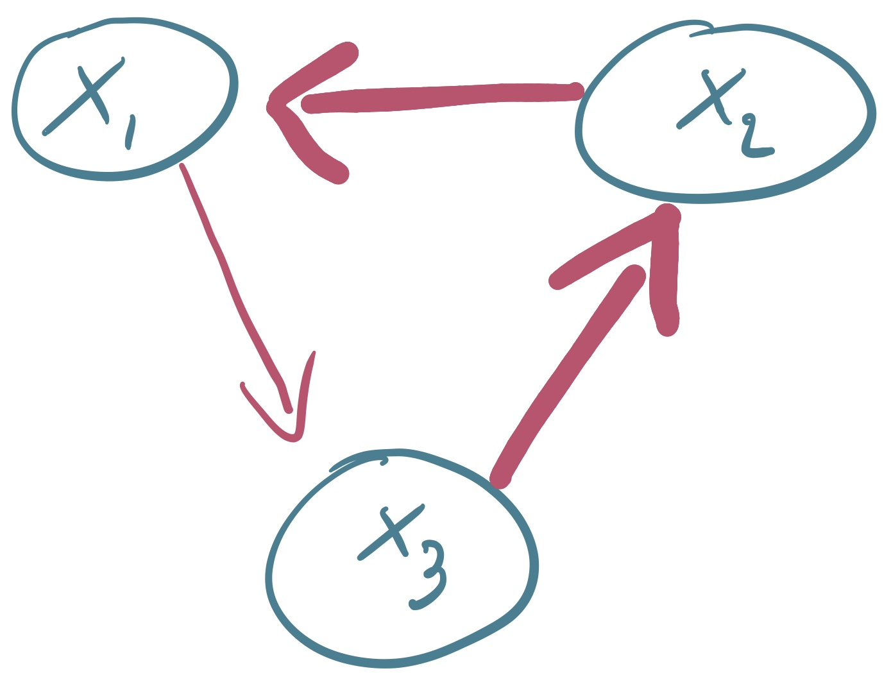]] .kol-4-12[.width-100[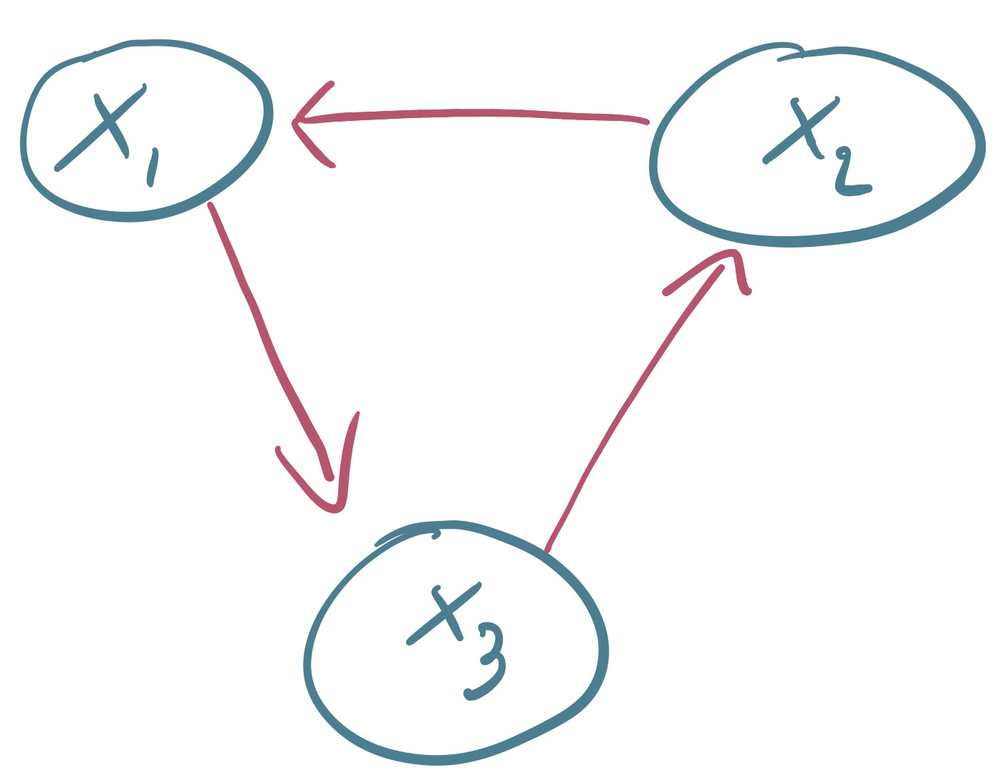]] .kol-4-12[.width-100[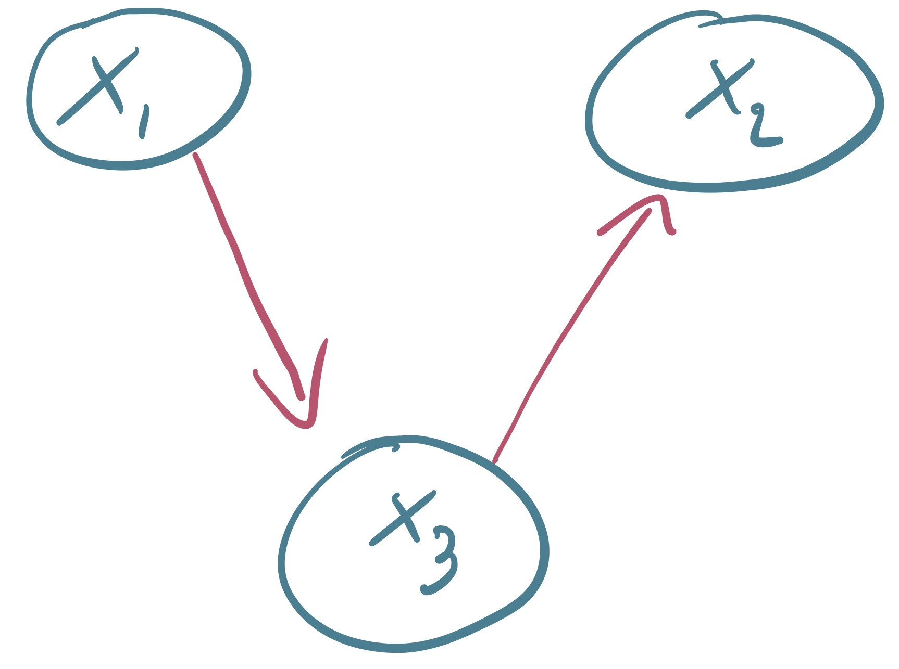]]  ]

???

Good for us, we can reformulate the combinatorial problem into a continuous constraint if we relax the adjacency matrix to contains real positive values instead of boolean. This matrix is such that a value of zero in the cell i,j means there is no edge from j to i, else if this is non zero the connection from j to i is as strong as the value is large. And so we can formulate the acyclicity constraint as the function w of A, that is as large as there are path with strong connection to go from a node to itself. For example here the value of w A in the left graph is high because the edges that must be used to go from a node to itself are large, it is smaller in the middle graph because these edges are tighter and exactly 0 in the right one because it does not containt any cycle.

--

- We can solve the continuously constrained problem with a Lagrangian formulation!

???

Now that we have a continuous constraint to express acyclicity we can use Lagrangian formulation to solve this optimization problem under constraints.
---

# Computational cost

- Solving the sub-problems to optimality increases computational cost 😈
- As fast as autoregressive or coupling layers at inference time 💪
- The inversion of the flow will be often faster than autoregressive architectures 💪

???

So we have shown that we can even hope finding a BN that leads to good density estimation performances. But this has of course a cost. In particular, during training phase this optimization takes some times to converge from something that is not acyclic, as we start with a graph that is fully connected, to an acyclic graph and that we hope yields to good density estimations performances. At test time however the graphical conditioner is as fast as autoregressive or coupling layers and the inverse transformation can be computed in a smaller number of iterations than for autoregressive layers if the BN is sparse.

---

# Results
## Known vs Unknown Topology (Monotonic transformer)
.center.grid[
.kol-6-12[
*Effect of sparsity*
.width-90[]
]
.kol-6-12[
*Topology recovered*
.width-70[]
]
]
*Learning a good topology helps for density estimation.*

???

Let us have a look at some results when learning the topology with this constraint optimization problem. On the left you see the results for an artificially generated dataset made of 8 pairs of independent variables, these are 8 2D complex distribution such as the one I showed you at the beginning of this presentation. So to create the data we just concatenate 8 datasets that correspond to each pair of variable. On the left plot you see the log likelihood of the model as a function of the sparstity of the recovered topology, the sparstiy can be controled with l1 penalization on the adjacency matrix. In red are the results with a correct adjacency matrix and in green with an autoregressive layer. We see that learning the topology, may improve the results with respect to autoregressive layers. Indeed we may suppose that the capacity of the flow may be used in a more efficient way if you make the right independence assumption which is not the case of autoregressive layers. The right plot show one correct adjacency matrix for this problem in black are the cells that are equal to one and in grey this just the transposition of this matrix, you can see there that the pairs of variables are independent, the stars show the edges discovered by the optimization procedure. From this we can conclude that the optimization is able to remove spurious edges and keeps relevant dependencies.

---

# Results
## Density estimation benchmark

.width-90.center[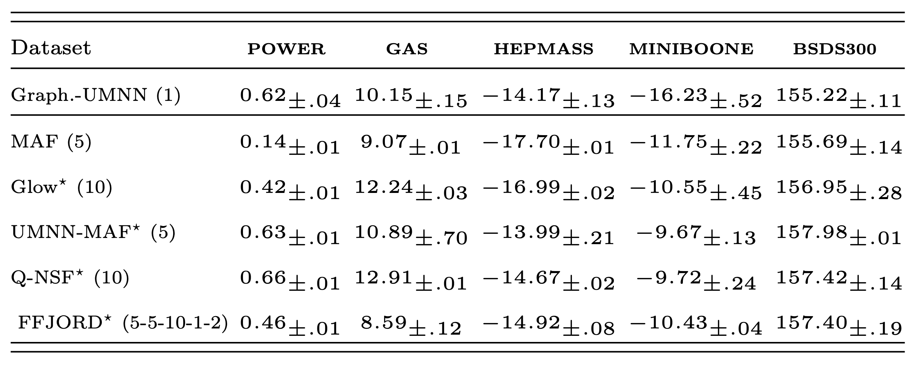]

*We may obtain density estimation results on par with the best NF architectures.*

???
The previous example showed that in a controlled setting the graphical conditioner seems to work well but is this the case in some more realistic settings? Here we benchmark a normalizing flow made of one graphical conditioner in which we learn the topology with the most commonly used flow architectures on some standard benchmarks. We observe that we reach quite competitive performances even if we only use one step of transformation and that we have something that may be interpreted as a BN. This is interesting because this shows that we are able to have density estimation that is almost as good as black box models with a model from which we can easily understand and force some independencies.

---

# Conclusion
- Standard Normalizing Flows are Bayesian Networks.
- Any Bayesian network can be easily turned into a normalizing flow.
- This allows introducing independency assumptions into the modeled density.
- This architecture can be used to do graphical model discovery.

## References:
- Graphical Normalizing Flows, A. Wehenkel and G. Louppe, October 2020 - https://arxiv.org/abs/2006.02548
- You say Normalizing Flows I see Bayesian Networks, A. Wehenkel and G. Louppe, June 2020 - https://arxiv.org/abs/2006.00866

.center.important[Thanks for listening]

???
## For NFs
  - Unify classical neural network design and flow design - FFJORD and I-resnet are steps toward this direction.
  - Study how inductive bias interacts with likelihood and sampling quality.

---
count:false

# Results
## Known vs Unknown Topology (Monotonic transformer)
.center.grid[
.kol-6-12[
*8 pairs of independent variables*
.width-70[]
.width-50[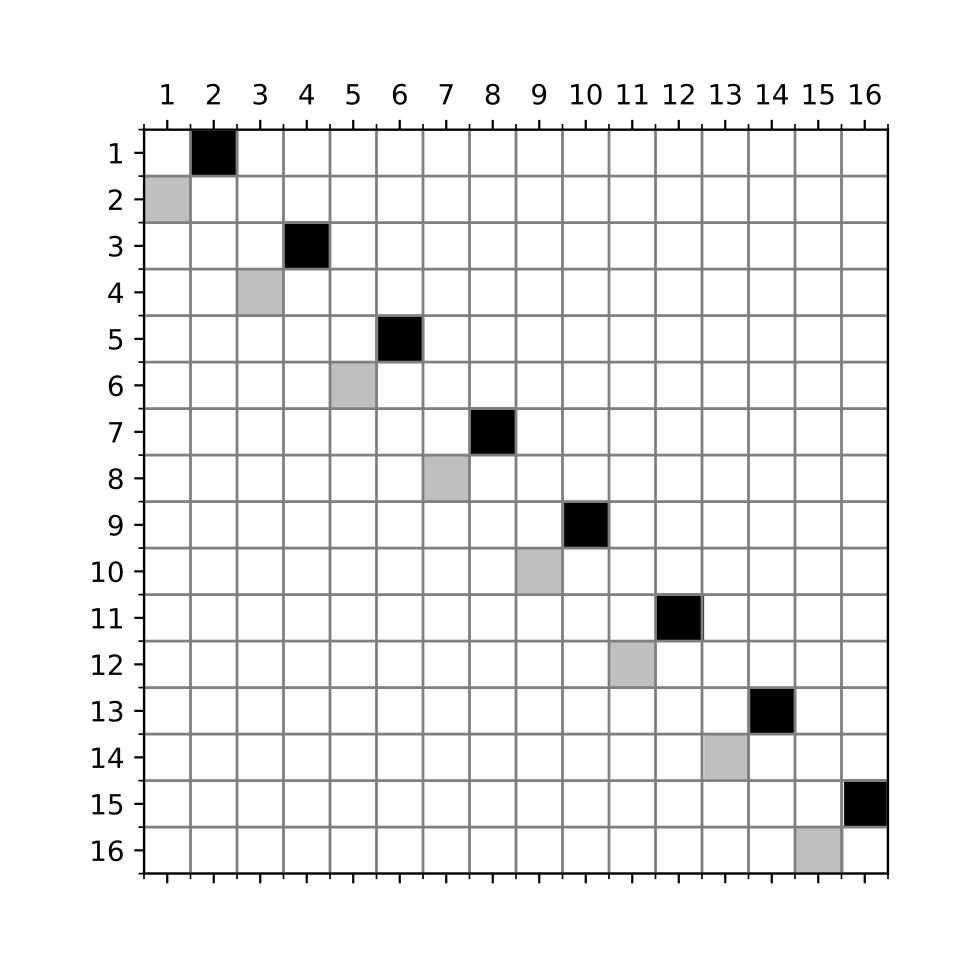]
]
.kol-6-12[
*Human protein dataset*
.width-70[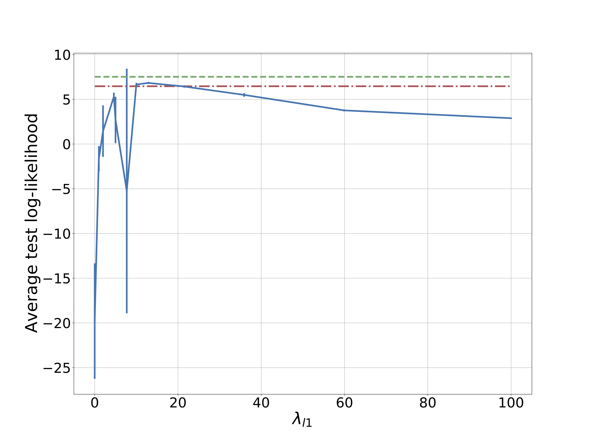]
.width-50[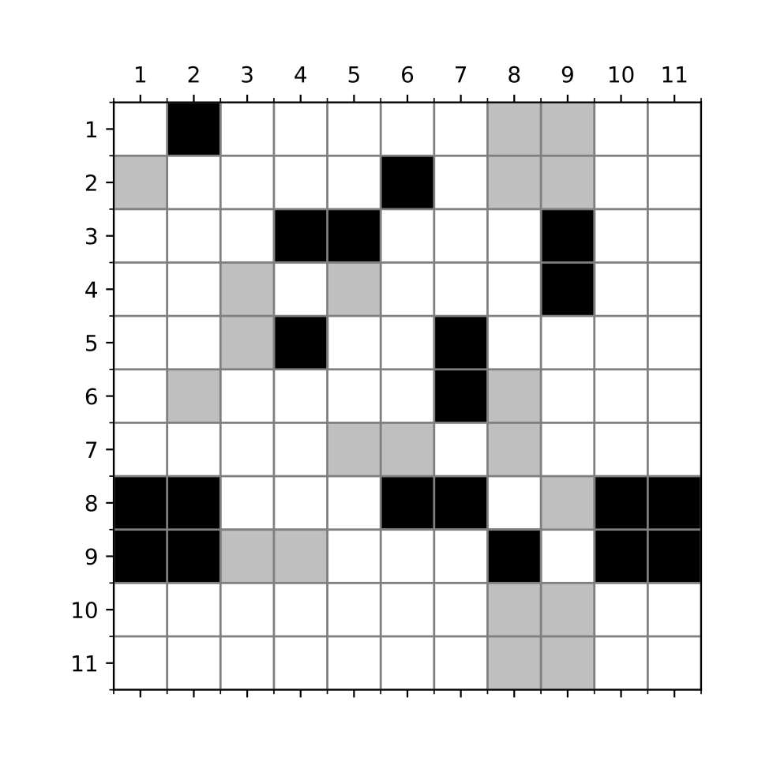]
]
]
*Learning a good topology helps for density estimation.*

???

Let us have a look at some results when learning the topology with this constraint optimization problem. On the left you see the results for an artificaly generated dataset made of 8 pairs of independent variables, these are 8 2D complex distribution such as the one I showed you at the beginning of this presentation. The bottom plot show one correct adjacency matrix for this problem in black are the cell that are equal to one and in grey this just the transposition of this matrix, you can see there that the pairs of variables are independent. On the top plot you see the log likelihood of the model as a function of the sparstity of the recovered topology, the sparstiy can be controled with l1 penalization of the adjacency matrix. In red are the results with a correct adjacency matrix and in green with an autoregressive layer. We see that learning the topology, may improve the results with respect to autoregressive layers. Indeed we may suppose that the capacity of the flow may be used in a more efficient way if you make some independence assumption which is not the case of autoregressive layers.  

---
count:false

# Results
## Relevance of the discovered topology (Monotonic transformer)
.center.grid[
.kol-6-12[
*8 pairs of independent variables*
.width-80[]
]
.kol-6-12[
*Human protein dataset*
.width-80[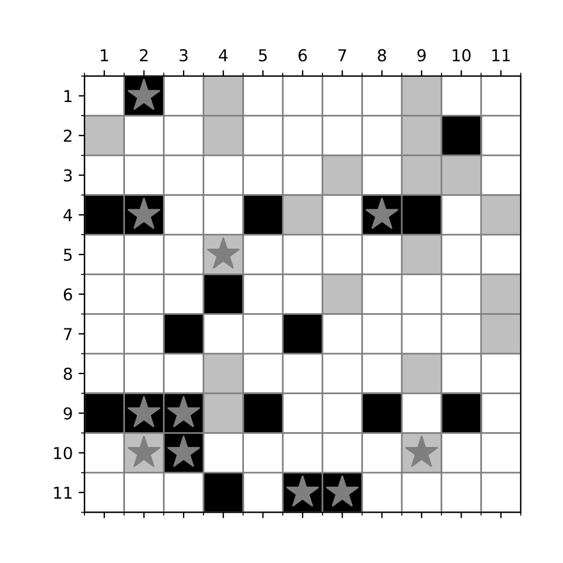]
]
]

*The optimization is able to remove spurious dependencies and keeps the correct ones.*
